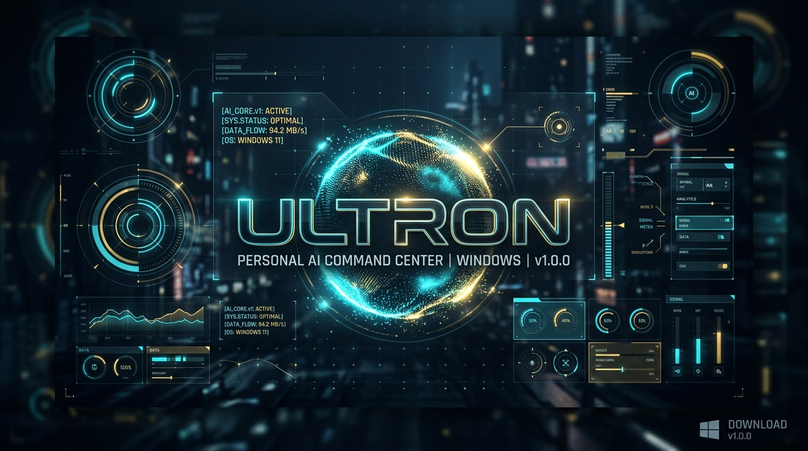

# ULTRON

### Personal AI Command Center for Windows

> **AI reasoning. Windows automation. Persistent memory. Research. PowerShell. Android integration. One desktop command center.**

**ULTRON v1.0.3 — Personal AI Command Center**
*Developed by UPAI Technologies • Founder: Sukesh D.*

[](https://github.com/sukeshd-me/Ultron/releases/tag/v1.0.3)
[](https://github.com/sukeshd-me/Ultron)
[](LICENSE)
[](TRADEMARK.md)
[](https://www.typescriptlang.org/)
[](https://www.electronjs.org/)
[](https://threejs.org/)
[](https://nodejs.org/api/sqlite.html)

<p align="center">
  
</p>

---

## What is ULTRON?

**ULTRON** is an open-source Windows Personal AI Command Center designed to unify large language model reasoning, local computer automation, persistent memory, PowerShell execution, web research, Android device integration, and a reactive desktop interface into a single, cohesive desktop system.

Unlike browser-based AI chatbots that are isolated from your workstation, ULTRON runs natively on Windows 11. It understands natural language requests, plans safe tool executions, interacts with the Windows operating system via a typed tool registry, remembers your context across sessions in an embedded SQLite database, and presents operating system feedback through a futuristic 3D HUD interface.

```
+-----------------------------------------------------------------------------------+
|                                 USER REQUEST                                      |
+-----------------------------------------+-----------------------------------------+
                                          |
                                          v
+-----------------------------------------------------------------------------------+
|                        CENTRALIZED MASTER AGENT LOOP                              |
|                                                                                   |
|  [ System Prompt ]  -->  [ Context & SQLite Memory ]  -->  [ Intent Normalizer ]  |
|                                                                    |              |
|                                                                    v              |
|  [ OS Verification ] <-- [ Typed Tool Execution ] <-- [ Security Validation ]     |
|           |                                                                       |
|           v                                                                       |
|  [ Memory Log & Telemetry ]  ------------------------>  [ Natural Response + HUD ]|
+-----------------------------------------------------------------------------------+
```

---

## Key Features

### 1. Multi-Tier AI Reasoning Architecture
- **NVIDIA Cloud AI Integration**: Native support for high-throughput cloud inference models including `nvidia/nemotron-3.5-lightning-30b-a3b` via the NVIDIA API Foundation.
- **Three Operational Modes**:
  - **`AUTO` Mode**: Seamlessly leverages cloud reasoning when online and falls back to deterministic local execution when disconnected.
  - **`ONLINE` Mode**: Prioritizes cloud LLM planning with full contextual reasoning.
  - **`OFFLINE` Mode**: 100% operational local execution with zero cloud API keys, zero internet egress, and zero external dependencies.
- **Sub-50ms Fast-Track Routing**: Common OS diagnostics (CPU, RAM, Disks, Wi-Fi status, time, application launching) bypass LLM network round-trips for instant local execution.

### 2. Typed Windows & Android Tool Registry (34 Verified Tools)
ULTRON does **not** allow arbitrary LLM-generated shell script execution. Every operating system interaction is constrained to a typed, validated schema:
- **System Diagnostics**: `system.getTime`, `system.getDate`, `system.getCpu`, `system.getMemory`, `system.getDisk`, `system.getProcesses`.
- **Application Control**: `apps.open` (Calculator, Notepad, Google Chrome, Windows Terminal, Settings, Explorer, VS Code, and custom applications).
- **Filesystem Automation**: `filesystem.list`, `filesystem.search`, `filesystem.createFile`, `filesystem.createDirectory`, `filesystem.read`, `filesystem.copy`, `filesystem.move`, `filesystem.rename`, `filesystem.delete`.
- **Network & Wi-Fi**: `network.getStatus`, `network.getWifiStatus`, `network.enableWifi`, `network.disableWifi`, `network.getAdapters`, `network.getIp`, `network.getDns`, `network.getAvailableNetworks`.
- **Cybersecurity Posture**: `security.getFirewallStatus`, `security.getDefenderStatus`, `security.getListeningPorts`.
- **Windows 11 Settings**: `settings.open` (Deep-links to native Windows Settings pages such as Display, Sound, Apps, Windows Update, Bluetooth).
- **Android Phone & App Control (v1.0.2)**:
  - `android.openApp`: Launch 30+ curated mobile apps via ADB monkey (YouTube, WhatsApp, Spotify, Camera, Maps, etc.).
  - `android.listApps`: List and cache installed third-party package IDs.
  - `android.callContact`: Search contacts via Android content provider and dial phone numbers.
  - `android.endCall`: Hang up active phone calls via `KEYCODE_ENDCALL`.
  - `android.muteCall`: Toggle microphone mute state via `KEYCODE_MUTE`.
  - `android.getPhoneState`: Full 12-state phone lifecycle state machine.
- **Android Device & Hardware**: `adb.connect`, `adb.getDevices`, `adb.makeCall`, `adb.sendMessage`, `adb.wakeScreen`, `adb.unlockPhone`.

### 3. Local Speech-to-Text via OpenAI Whisper (New in v1.0.2)
- **100% Local & Privacy-First**: Audio frames captured via WebRTC/MediaRecorder are processed on-device with zero cloud egress.
- **High-Performance Python Worker**: Powered by `faster-whisper` (CTranslate2) with persistent stdin/stdout JSON-RPC communication.
- **Multi-Model Hot-Swapping**: Switch between `tiny.en`, `base.en`, `small.en`, and `turbo` profiles directly in Settings.
- **Audio Pulse HUD**: Microphone button pulses with dynamic state animation (`Idle`, `Recording`, `Transcribing`, `Executing`, `Completed`, `Error`).
- **Telemetry Precision**: Measures exact timings for `audio_capture_ms`, `vad_ms`, `stt_ms`, `intent_ms`, `planning_ms`, `tool_ms`, `verification_ms`, and `total_ms`.
- Complete documentation: [VOICE_GUIDE.md](VOICE_GUIDE.md).

### 4. Persistent SQLite Memory Engine
- Embedded, zero-latency database powered by `node:sqlite` located in `data/ultron_memory.sqlite`.
- Stores conversation history, explicit user facts (`memory.store`, `memory.search`, `memory.delete`), task execution logs, and configuration state.
- Interactive **Memory Inspector** UI tab allows viewing, searching, and deleting saved memories in real time.
- Automatic secret and PIN redaction on all voice action records.

### 5. Android Hardware Control & DPAPI Security Vault
- Connects directly to Android devices over authorized USB debugging or Wi-Fi using the Android Debug Bridge (ADB).
- **Zero-Storage Phone PIN Vault**: Encrypts device unlock credentials via **Windows DPAPI** (`safeStorage`), ensuring sensitive PINs are **never** stored in SQLite memory tables, logs, or chat transcripts.
- Real-time device telemetry: model name (e.g. `vivo V2355`), Android OS version (`Android 16`), battery charge percentage, and charging state.

### 6. First-Run NVIDIA AI Onboarding
- Interactive setup dialog on first launch with direct links to the official [NVIDIA API Catalog](https://build.nvidia.com).
- Live latency ping testing to verify cloud inference connectivity in milliseconds.
- Instant fallback to 100% functional offline mode with a single click.

### 7. Explicit Web Research & Media Launcher
- **Web Search**: Launches targeted queries in your default browser and extracts verified information without background scraping.
- **YouTube Research**: Deep-links research topics and queries directly into video platforms.

### 8. Reactive 3D Core & Simplified Command HUD
- Built with **Three.js** and **React-Three-Fiber**.
- Dynamic procedural particle core that reacts visually to agent states (Cyan, Gold, Emerald, Crimson).
- Simplified, chat-first navigation: *"Talk to ULTRON and it handles the rest."*

---

## What Can ULTRON Do?

Every capability listed below is backed by a verified, implemented tool in the codebase:

| What you say to ULTRON | What ULTRON actually does on Windows 11 & Android |
|---|---|
| *(Click Mic)* *"Open YouTube on my phone"* | Transcribes locally with Whisper and launches YouTube on Android via `android.openApp`. |
| *(Click Mic)* *"Call Sukesh"* | Resolves contact number and initiates mobile dialing via `android.callContact`. |
| *(Click Mic)* *"Hang up phone"* | Terminates active call immediately via `android.endCall`. |
| *(Click Mic)* *"Check phone status"* | Queries 12-state phone state machine via `android.getPhoneState`. |
| *"Open Chrome"* | Resolves browser executable and launches Google Chrome via `apps.open`. |
| *"Find files related to my project"* | Executes scoped filesystem traversal via `filesystem.search` and returns matching paths. |
| *"Show my system status"* | Queries real CPU load, RAM utilization, and free disk space via `system.getCpu`, `system.getMemory`, `system.getDisk`. |
| *"Check Wi-Fi status"* | Reads native Wi-Fi adapter state, connected SSID, signal quality, and radio power via `network.getWifiStatus`. |
| *"Research this topic"* | Opens verified web research queries in your browser via `research.search`. |
| *"Connect to my Android device"* | Detects ADB-connected phone, queries battery level, Android version, and hardware identity via `adb.getDevices`. |
| *"Remember that my server IP is 192.168.1.100"* | Persists structured key-value memory entry into SQLite via `memory.store`. |
| *"What is my server IP?"* | Recalls stored memory records via `memory.search` and reports the answer. |
| *"Check firewall status"* | Verifies Windows Defender Firewall profiles (Domain, Private, Public) via `security.getFirewallStatus`. |
| *"Open display settings"* | Triggers `ms-settings:display` URI to immediately open the Windows 11 Display settings page. |
| *"Continue working offline"* | Fully routes queries through the local deterministic engine when internet or cloud APIs are unavailable. |

---

## Online vs. Offline Capabilities

ULTRON was engineered from day one with an **offline-first hybrid architecture**. You are never locked out of your computer if your internet goes down:

| Capability | ONLINE Mode | OFFLINE Mode |
|---|:---:|:---:|
| Local Voice-to-Text (OpenAI Whisper) | **YES** | **YES** |
| Android app launching & call controls | **YES** | **YES\*** |
| Windows local OS control | **YES** | **YES** |
| Local filesystem tools | **YES** | **YES** |
| Persistent SQLite memory | **YES** | **YES** |
| Safe PowerShell tools | **YES** | **YES** |
| Local system diagnostics (CPU/RAM/Disk) | **YES** | **YES** |
| Application launching | **YES** | **YES** |
| Windows Settings deep links | **YES** | **YES** |
| Deterministic local fast-track routing | **YES** | **YES** |
| Android ADB hardware control | **YES** | **YES\*** |
| NVIDIA Cloud AI (Nemotron 30B reasoning) | **YES** | **NO** |
| Live web research & search | **YES** | **NO** |

*\* Android ADB operations require a physical USB connection or local network pairing to your device.*

---

## System Requirements

### Minimum Requirements
- **Operating System**: Windows 11 64-bit (Build 22000+) or Windows 10 64-bit (Build 19041+)
- **Processor**: Dual-core x64 CPU @ 2.0 GHz or higher
- **Memory**: 8 GB RAM
- **Storage**: 2 GB available disk space (for application and runtime dependencies)
- **Display**: 1280 x 720 resolution
- **Shell**: Windows PowerShell 5.1 (standard in Windows 11)

### Recommended Specifications
- **Operating System**: Windows 11 64-bit (Latest updates)
- **Processor**: Quad-core x64 CPU (Intel Core i5 / AMD Ryzen 5 or better)
- **Memory**: 16 GB RAM
- **Storage**: 5 GB+ available SSD storage
- **Display**: 1920 x 1080 (Full HD) or higher
- **Network**: Stable broadband internet connection (for NVIDIA Cloud AI & web research)
- **Mobile (Optional)**: Android device with USB Debugging enabled and ADB on PATH

> **Note on GPUs**: A dedicated NVIDIA GPU is **not required** to use ULTRON. Cloud AI reasoning is computed via NVIDIA's cloud inference infrastructure. A dedicated GPU will, however, provide enhanced 60 FPS rendering for the 3D particle HUD.

---

## Quick Start Installation

1. **Download the Installer**:  
   Download the official production installer from the [Releases Page](https://github.com/sukeshd-me/Ultron/releases/tag/v1.0.1):
   ```
   dist/ULTRON-Setup-1.0.1.exe
   ```
2. **Run the Setup Wizard**:  
   Double-click `ULTRON-Setup-1.0.1.exe` and follow the standard Windows installation steps.
3. **Launch ULTRON**:  
   Open ULTRON from your Desktop or Start Menu.
4. **Configure Settings (Optional)**:  
   - Click the gear icon in the sidebar to open **Settings**.
   - If you wish to enable cloud reasoning, enter your free [NVIDIA AI Foundation Key](https://build.nvidia.com) and click **Test API Server**.
   - If you wish to use Android tools, confirm your ADB executable path.
5. **Start Commanding**:  
   Type any request into the chat bar or explore the quick-action buttons.

For a detailed step-by-step guide with screenshots and troubleshooting, read the [Installation Guide](INSTALLATION.md).

---

## Agent Execution Lifecycle

ULTRON operates under a strict, verifiable agent lifecycle ensuring every action is accounted for:

```
[1. User Prompt]
       │
       ▼
[2. Context Assembly] ──► Query active conversation history & SQLite memories
       │
       ▼
[3. Intent Normalization] ──► Classify intent: SYSTEM, APPS, FILESYSTEM, NETWORK, SECURITY, RESEARCH, ADB
       │
       ▼
[4. Safety Policy Validation] ──► Check path boundaries, forbidden syntax, admin privileges
       │
       ▼
[5. Typed Tool Invocation] ──► Dispatch to deterministic TypeScript tool handler
       │
       ▼
[6. OS Verification] ──► Check exit code, process existence, or filesystem mutation
       │
       ▼
[7. Memory Update & Telemetry] ──► Persist audit record to SQLite & measure latency (ms)
       │
       ▼
[8. Natural Response + HUD Update] ──► Stream explanation to user & animate 3D core
```

---

## Documentation Directory
 
Explore the detailed technical documentation:
 
| Document | Description |
|---|---|
| [**User Guide (v1.0.1)**](USER_GUIDE.md) | Complete operations manual covering commands, UI HUD, phone security, and modes. |
| [**Architecture Specification**](ARCHITECTURE.md) | System overview, DPAPI credential vault, ADB engine, and tool registry. |
| [**Installation Guide**](INSTALLATION.md) | First-time setup, portable mode, configuration, and uninstallation. |
| [**Security Architecture**](SECURITY.md) | Threat modeling, zero-storage PIN isolation, and safe process execution. |
| [**Changelog**](CHANGELOG.md) | Release history, verified capabilities, and binary checksums. |
| [**Social Launch Kit (v1.0.1)**](SOCIAL_LAUNCH_1.0.1.md) | Launch announcement copy for X, LinkedIn, Reddit, Discord, and YouTube. |
| [**Developer Guide**](docs/DEVELOPER_GUIDE.md) | Electron architecture, IPC channels, building tools, and testing. |
| [**Contributing Guide**](CONTRIBUTING.md) | How to build from source, write tests, and submit pull requests. |

---

## Running from Source (Developers)

```powershell
# 1. Clone the repository
git clone https://github.com/sukeshd-me/Ultron.git
cd Ultron

# 2. Install dependencies
npm install

# 3. Verify TypeScript types
npx tsc --noEmit

# 4. Launch in development mode with Hot Reload
npm run dev

# 5. Build production bundle and Windows installer
npm run build
npm run build:win
```

Headless CLI mode:
```powershell
node cli.js
```

---

## ⭐ Support ULTRON

If ULTRON is useful to you, helps automate your workflow, or inspires your personal AI projects:

- ⭐ **Star the repository** to boost discoverability.
- 🍴 **Fork it** and build custom Windows tools.
- 🐛 **Report bugs** and edge cases in the Issues tab.
- 💡 **Suggest new capabilities** in Discussions.
- 🔧 **Submit Pull Requests** to expand the typed tool registry.
- 📢 **Share ULTRON** with developers and automation enthusiasts.

*The road to 100K stars starts with one star.*

---

## License & Trademark Notice

ULTRON is an open-source project created by [Sukesh D](https://github.com/sukeshd-me).

- **Software Source Code**: Distributed under the permissive [MIT License](LICENSE). You are free to use, modify, study, and integrate the code into your own projects.
- **Trademark & Brand Protection**: The name **"ULTRON"**, the official logo, brand iconography, and distinct 3D HUD visual identity are proprietary marks reserved by the author. Use of these marks is governed by our [Trademark & Branding Policy](TRADEMARK.md). If you distribute a modified fork of this software, you must rebrand your distribution.
